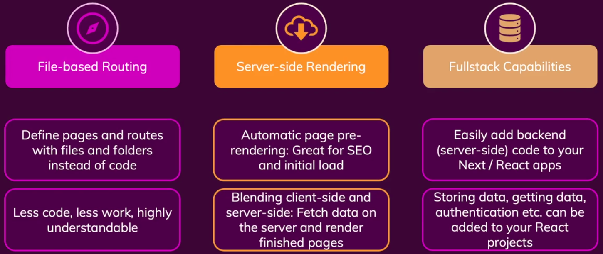

# Table Of Content

# Introduction to Next.js

## What is NextJs

- Next JS is a React framework for production
- But, it's a full stack framework for React JS
- Next JS solves common problems and makes building React apps easier


## Key Feature 1: Built-in Server-side Rendering (Improved SEO)

- _Most Important:_ Built-in Server-side rendering support
- _Server Side Rendering:_ Preparing the content of a page on the server instead of on the client
- Due to client side rendering happens in React JS,
  - Fetching data from the server and render in the client side
  - User will see loading phase (wait for a while)
- That loading delay is not good for user experience
- It can be ignore
- But, while using SEO (Search Engine Optimization), it can't be ignore
- So, if the page is pre-rendering and data fetching done on the server, when the request hits the server
- Then the finished page would be served to the user and Search Engine crawlers
- Results,
  - User would not have gone through loading state
  - Search engine would see the page content

## Key Feature 2: Simplified Routing with File-based Routing

- _Feature: 02:_ File-based Routing
- Define pages & routes with files and folders

## Key Feature 3: Build Fullstack Apps

- _Feature: 02:_ Full stack feature
- _Overall Features:_



## Creating a New Next.js project & App

- To create a Next JS project -

```txt
npx create-next-app
# or
yarn create next-app
```

## Analyzing the Created Project

- Prepare the project -

```txt
npm install
```

- _Note:_ Next JS allows us to determine when a page should be pre-rendered

## Adding First Pages

- `/pages/index.js` file is the root page, i.e. `https://localhost:3000/`

```js
const HomePage = () => {
  return <p>The Home Page</p>
}

export default HomePage
```

- `/pages/news.js` file is the news page, i.e. `https://localhost:3000/news`

```js
const NewsPage = () => {
  return <p>The News Page</p>
}

export default NewsPage
```

## Adding Nested Paths & Pages(Nested Routes)

- Creating path in two ways -
  - _Way 01:_ Create `/pages/news.js` file way
  - _Way 02:_ Create `/pages/news/index.js` file way
- But, _Way 02_ is useful for nested routes or paths
- Like, `/pages/news/detail.js` or `/pages/news/detail/index.js` file denotes `https://localhost:3000/detail` url

## Creating Dynamic Pages (with Parameters)

- `[]` denotes dynamic pages
- Inside `[]`, use an identifier
- So, `/pages/news/[newsId].js` file denotes `https://localhost:3000/news/abc`
- But, if create a specific route then use that
- Like, `/pages/news/detail.js` file denotes `https://localhost:3000/news/detail`

## Extracting Dynamic Parameter Values

- Use `useRouter` hook exposes routing specific functionality
- Importing from `next/router`
- Accessing routing properties & methods in `/pages/news/[newsId].js` file -

```js
import { useRouter } from 'next/router'

const DetailPage = () => {
  const router = useRouter()

  const newsId = router.query.newsId

  return <p>{`The Detail Page - ${newsId}`}</p>
}

export default DetailPage
```

- Fetching the paths using `router.query.newsId` as file name `[newsId].js`
- So, hitting `https://localhost:3000/news/new-news`, results `new-news` using `router.query.newsId`

## Linking Between Pages

- Use `Link` component from `next/link` package

```js
<Link href='/news/nextjs-is-a-great-framework'>Next JS</Link>
```
