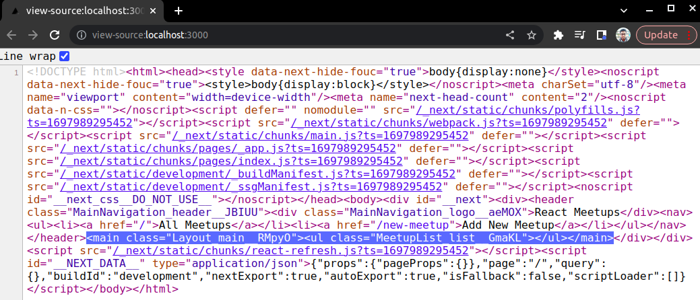
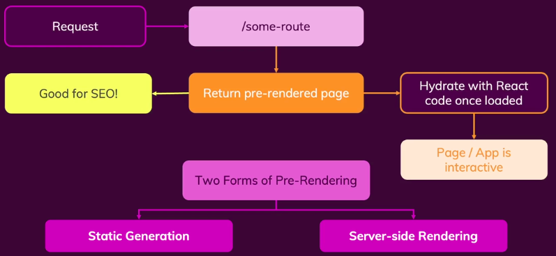
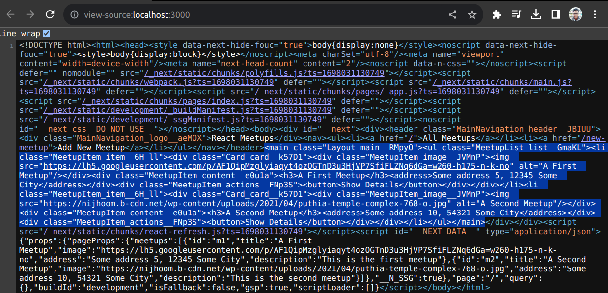
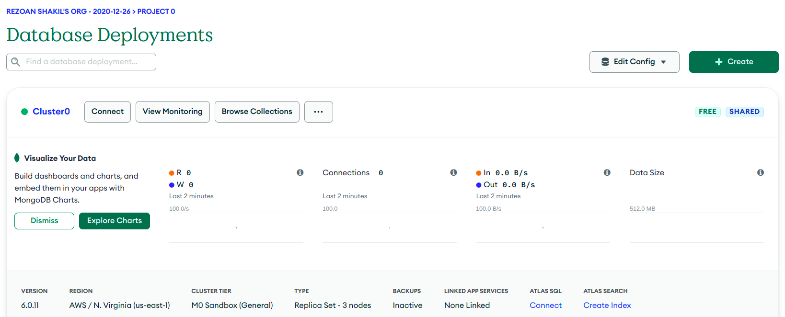
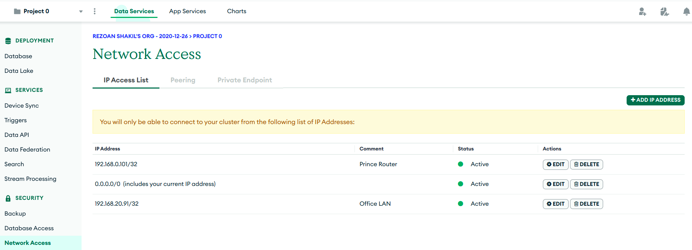
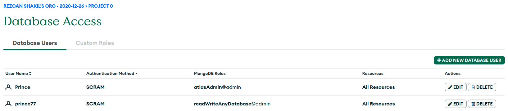
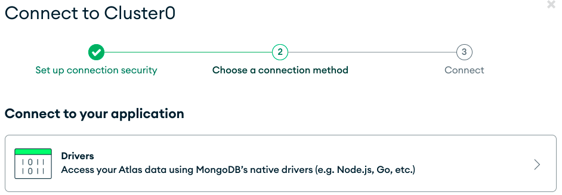
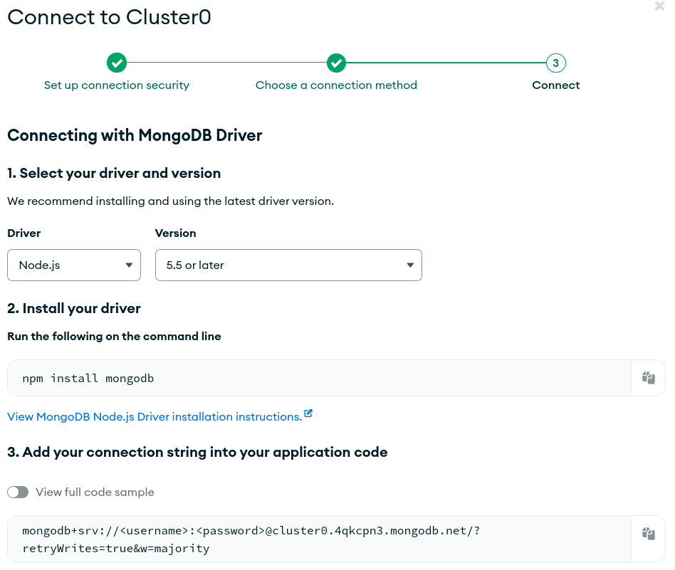

# Table Of Content

- [Table Of Content](#table-of-content)
- [Next JS Meetup](#next-js-meetup)
  - [The `_app.js` File \& Layout Wrapper](#the-_appjs-file--layout-wrapper)
  - [Using programmatic (Imperative) Navigation](#using-programmatic-imperative-navigation)
  - [Data Fetching for Static Pages](#data-fetching-for-static-pages)
  - [More on Static Site Generation (SSG)](#more-on-static-site-generation-ssg)
  - [Exploring Server-side Rendering (SSR) with `getServerSideProps`](#exploring-server-side-rendering-ssr-with-getserversideprops)
  - [Preparing Paths with `getStaticPaths` \& Working With Fallback Pages](#preparing-paths-with-getstaticpaths--working-with-fallback-pages)
  - [Introducing API Routes](#introducing-api-routes)
  - [Working with MongoDB](#working-with-mongodb)

# Next JS Meetup

## The `_app.js` File & Layout Wrapper

- Can wrap all the page components with `Layout` wrapper component

```js
import Layout from '../components/layout/Layout'
import MeetupList from '../components/meetups/MeetupList'

const HomePage = () => {
  return (
    <>
      <Layout>
        <MeetupList meetups={DUMMY_MEETUPS} />
      </Layout>
    </>
  )
}

export default HomePage
```

- But, it's not feasible
- In `_app.js` file, `MyApp` is a special component acts as the root component, Next JS will render
- `Component` is a props Component
- It holds the actual page contents which should be rendered
- It will be different whenever switching a page
- `pageProps` is special props my pages might be getting
- `Component` & `pageProps` are passed by Next JS
- In `_app.js` file, it is the actual page content of our different pages
- And it will change whenever navigating from PageA to PageB
- Instead of wrapping different page file, utilize `_app.js` file
- Simply wrap `Component` props with `Layout` component

```js
import Layout from '../components/layout/Layout'

import '../styles/globals.css'

function MyApp({ Component, pageProps }) {
  return (
    <>
      <Layout>
        <Component {...pageProps} />
      </Layout>
    </>
  )
}

export default MyApp
```

## Using programmatic (Imperative) Navigation

- Use `useRouter` hook to push a new page onto the stack of pages
- It's the equivalent of using the `Link` component

```js
import { useRouter } from 'next/router' // Importing package

function MeetupItem(props) {
  const router = useRouter() // Use 'useRouter' hook

  const showDetailsHandler = () => {
    router.push('/' + props.id) // Programmatically navigate to dynamic link
  }

  return <button onClick={showDetailsHandler}>Show Details</button>
}

export default MeetupItem
```

## Data Fetching for Static Pages

- While fetching data from an API, database or file system, use like -

```js
import { useState, useEffect } from 'react'

const DUMMY_MEETUPS = [
  {
    id: 'm1',
    title: 'Title',
    image: 'Image',
    address: 'Address',
    description: 'Description',
  },
]

const HomePage = () => {
  const [meetups, setMeetups] = useState([]) // Manage an extra state

  useEffect(() => {
    setMeetups(DUMMY_MEETUPS) // Data fetching after rendering the component
  }, [])

  return <MeetupList meetups={meetups} />
}

export default HomePage
```

- _Problem:_
  - View an empty `[]` in the page source code
  - Can't find the page content while SEO



- _Reason:_
  - When component render initially, at first takes `[]` array
  - An `[]` array render on the server and send it to the client
  - Client will see the received content from the server
  - After rendering the component, execute `useEffect`
  - React will hand over it and load once again with updated data



- To control how the pages should be rendered
- Use two pre-rendering method
  - Static Generation
  - Server-side Rendering
- _Static Generation:_
  - Used while building it for production
  - A page component is pre-rendered after building the application
- Use `getStaticProps` regarding that
- _MUST REMEMBER:_ Only works in the page component files
- Next JS looks `getStaticProps` in the page component file before rendering that page component
- If find it then execute it during pre-rendering process
- So, Next JS first call that function then execute that pages component function
- _JOB:_ Prepared `props` for this page component
- In `getStaticProps`, execute any codes what only run on the server
- That code execute during the `build` process
- Inside `getStaticProps`, should fetch data from on API, database or file system
- _MUST_ return an object named `props`
- _MUST_ export `getStaticProps` function
- Fetching data from API, so use `async`

```js
const HomePage = (props) => {
  return <MeetupList meetups={props.meetups} />
}

export const getStaticProps = async () => {
  return {
    props: {
      meetups: DUMMY_MEETUPS,
    },
  }
}

export default HomePage
```



## More on Static Site Generation (SSG)

- Use `revalidate` property
- Which works incremental Static Generation
- Takes number of seconds
- Next JS will wait until it regenerates this page for an incoming request
  - So, this page not just generate in build process &
  - Also be generated at least every 10 seconds if there are requests coming in for this page
- Then these regenerated pages would replace the old pre-generated pages
- Ensures that the data is never older than 10 seconds
- The number of seconds depends on the data update frequency

```js
export const getStaticProps = async () => {
  return {
    props: {
      meetups: DUMMY_MEETUPS,
    },
    revalidate: 10, // Data update frequency
  }
}
```

## Exploring Server-side Rendering (SSR) with `getServerSideProps`

- Regenerate pages for every incoming requests
- So, pre-generate the page dynamically after deployment on the server

```js
export const getServerSideProps = async (context) => {
  // Will use later
  const req = context.req
  const res = context.res

  return {
    props: {
      meetups: DUMMY_MEETUPS,
    },
  }
}
```

- _Disadvantage:_ Wait page to be generated on every incoming request
- _USE `getServerSideProps`:_ If data is not updated frequently & need `res` and `req`
- _USE `getStaticProps`:_ If data is updated frequently

## Preparing Paths with `getStaticPaths` & Working With Fallback Pages

- `getStaticPaths` is needed to export in the page component -
  - If this is a dynamic paths i.e. `pages/[meetupId]/index.js` location
  - And export `getStaticProps` on it
- Need pre-generated pages for all URLs
- As this is dynamic, Next JS needs to know which Id values should pre-generate this page
- If Id doesn't pre-generated for that dynamic URL, will see a `404` error page
- `getStaticPaths` returns an object which describes all the dynamic segment values
- So, all the meetup Ids for which this page should be pre-generated
- `fallback` defines path array contains all supported parameter values or some of them
- `fallback: false`
  - all supported parameter values
  - So, for `m3` will get an `404` error page
- `fallback: true`
  - some of them are supported
  - So, Next JS will generate a page for this meetup Id dynamically on the server for the incoming request

```js
export const getStaticPaths = async () => {
  return {
    fallback: false,
    paths: [
      {
        params: {
          meetupId: 'm1',
        },
      },
      {
        params: {
          meetupId: 'm2',
        },
      },
    ],
  }
}
```

- `getStaticPaths` runs during the build time
- When running in the development server, it does run for every incoming request
- But only on the developer server side
- So, for any `console.log`, will see output in the terminal not in the dev console or browser

## Introducing API Routes

- _API Routes:_
  - Doesn't return HTML code
  - Instead accepting incoming HTTP requests
  - HTTP requests are `POST`, `PATCH`, `PUT` & `DELETE` requests
  - Attached `JSON` data with them
  - Then return `JSON` data
- API Routes allow to build my own API end points
- To use this features, create a folder located `/pages/api`
- Create `/api` inside `/pages` folder
- So, Next JS picks up any JS files store in there
- And turns those files into API routes
- End points can be targeted by request
- And that should be received `JSON` & returned `JSON` data
- Inside `/api`, file name will act as path segments in the URL i.e. `/api/new-meetup.js`
- Doesn't define component
- Instead define functions which contains server-side code
- As API routes will only run on the server
- This code should not be exposed to the client
- Those functions are triggered whenever a request is sent to this route
- URL of this file will be `/api/new-meetup`
- Function takes two parameters -
  - `req` object - contains data about the incoming request
  - `res` object - for sending back a response
  - `res.body` - contains the data of the incoming request
- In `/pages/api/new-meetup.js` file -

```js
const handler = (req, res) => {
  if (req.method === 'POST') {
    const data = req.body

    const { title, image, address, description } = data
  }
}

export default handler
```

## Working with MongoDB

- use MongoDB Atlas which is cloud based mongoDB database
- _MongoDb Atlas Cluster:_



- Special make sure, use `MO Sandbox` as a cluster tier
- Under `Network Acess`, need to add local IP
- So, local computer is able to send request to MongoDB



- And Under `Database Acess`, need to create at least one user
- User must have read & write access to the database
- So, using this user, can connect to the database cluster



- On cluster, press `connect`



- Press `Drivers`



- Install mongoDB -

```txt
npm install mongodb
```

- Installed MongoDB driver which makes sending queries to MongoDB easy
- MongoDB driver allows to connect to the cluster
- Then insert data or fetch data from there
- _Note:_ MongoDB is a NoSQL database that works with collections full of documents
- Collection is kind of tables in a SQL database
- Documents is the entries in those tables
- So, collection holds multiple documents
- Like, table holds multiple entries
- In `/pages/api/new-meetup.js` file -

```js
import { MongoClient } from 'mongodb'

const handler = async (req, res) => {
  if (req.method === 'POST') {
    const data = req.body

    // Connect with the MongoDB
    // Return a 'Promise'
    const client = await MongoClient.connect(
      'mongodb+srv://<username>:<password>@cluster0.4qkcpn3.mongodb.net/meetups?retryWrites=true&w=majority'
    )

    // To hold the database which connected with
    // If database does not exist, it will create one database named 'meetups'
    const db = client.db()

    // Use same as database name. But can use different name as collection or table
    const meetupCollection = db.collection('meetups')

    // Query command
    // Passing an object
    // Return an object i.e. the automatically generated ID
    const result = await meetupCollection.insertOne(data)

    console.log(result)

    // Close the database
    client.close()

    // Use 'res' object to send back a response
    // 'status' method to set a HTTP status code
    // 201 - inserted successfully
    // 'json' method adds a outgoing response
    res.status(201).json({ message: 'Meetup inserted' })
  }
}

export default handler
```
