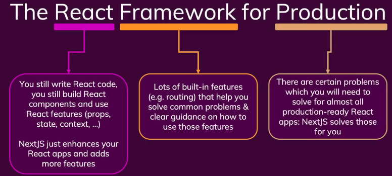
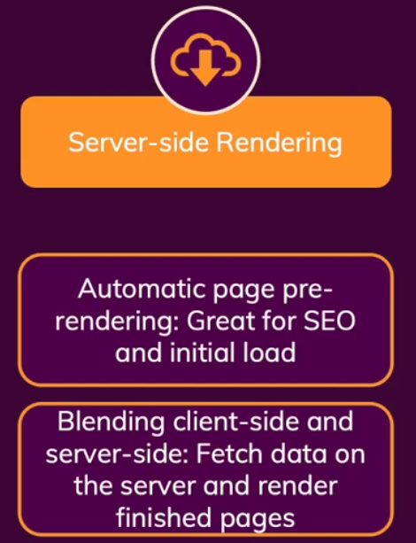

# Introduction to Next.js

## What is NextJs

- Next JS is a React framework for production
- But, it's a full stack framework for React JS
- Next JS solves common problems and makes building React apps easier

## Key Feature 1: Built-in Server-side Rendering (Improved SEO)

- _Most Important:_ Built-in Server-side rendering support
- _Server Side Rendering:_ Preparing the content of a page on the server instead of on the client
- Due to client side rendering happens in React JS,
  - Fetching data from the server and render in the client side
  - User will see loading phase (wait for a while)
- That loading delay is not good for user experience
- It can be ignore
- But, while using SEO (Search Engine Optimization), it can't be ignore
- So, if the page is pre-rendering and data fetching done on the server, when the request hits the server
- Then the finished page would be served to the user and Search Engine crawlers
- Results,
  - User would not have gone through loading state
  - Search engine would see the page content

## Key Feature 2: Simplified Routing with File-based Routing

- 

## Key Feature 3: Build Fullstack Apps

- 

